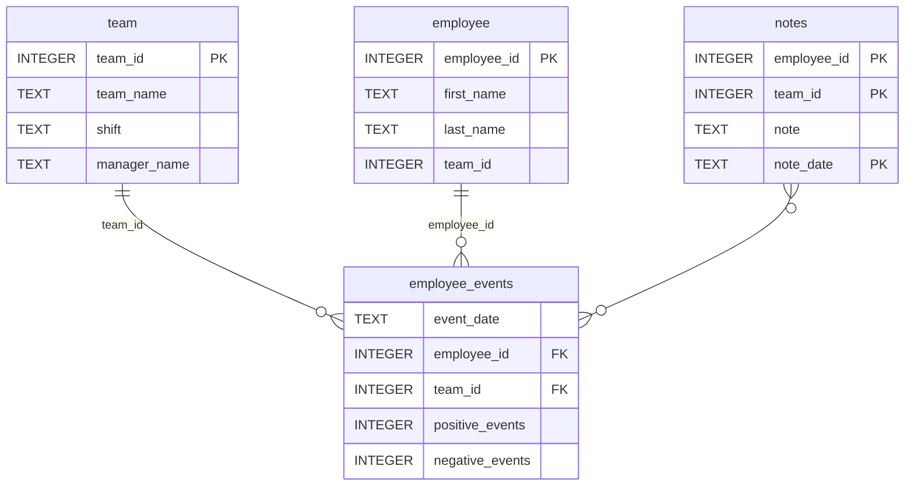

# Software Engineering for Data Scientists 

This repository contains starter code for the **Software Engineering for Data Scientists** final project. Please reference your course materials for documentation on this repository's structure and important files. Happy coding!

### Repository Structure
```
├── README.md
├── assets
│   ├── model.pkl
│   └── report.css
├── env
├── python-package
│   ├── employee_events
│   │   ├── __init__.py
│   │   ├── employee.py
│   │   ├── employee_events.db
│   │   ├── query_base.py
│   │   ├── sql_execution.py
│   │   └── team.py
│   ├── requirements.txt
│   ├── setup.py
├── report
│   ├── base_components
│   │   ├── __init__.py
│   │   ├── base_component.py
│   │   ├── data_table.py
│   │   ├── dropdown.py
│   │   ├── matplotlib_viz.py
│   │   └── radio.py
│   ├── combined_components
│   │   ├── __init__.py
│   │   ├── combined_component.py
│   │   └── form_group.py
│   ├── dashboard.py
│   └── utils.py
├── requirements.txt
├── start
├── tests
    └── test_employee_events.py
```

### employee_events.db




## Running the Application

This application is built with FastHTML and is designed to run behind a proxy. Follow these steps to set it up in your environment:

1. **Clone the Repository**
   - Clone the project and navigate to the directory:
     ```bash
     git clone <repository-url>
     cd <repository-name>
     ```

2. **Create and Activate a Virtual Environment**
   - Set up a virtual environment to manage dependencies:
     ```bash
     python -m venv venv
     source venv/bin/activate  # On Windows: venv\Scripts\activate
     ```

3. **Install Dependencies**
   - Install the required packages:
     ```bash
     pip install -r requirements.txt
     ```

4. **Run the Application**
   - The application requires the correct root path to match your proxy configuration. Start the server using Uvicorn with the `--root-path` option:
     ```bash
     uvicorn report.dashboard:app --root-path /your/proxy/prefix --port 5001
     ```
     - Replace `/your/proxy/prefix` with the prefix your proxy uses (e.g., `/proxy/5001`).
     - If you’re not running behind a proxy, use an empty root path:
       ```bash
       uvicorn report.dashboard:app --root-path "" --port 5001
       ```

5. **Access the Application**
   - With a proxy: Visit `http://localhost:5001/your/proxy/prefix` in your browser.
   - Without a proxy: Visit `http://localhost:5001`.

**Note**: The `--root-path` must align with your proxy’s forwarding setup. This ensures the application generates correct URLs dynamically using `request.url_for`.
